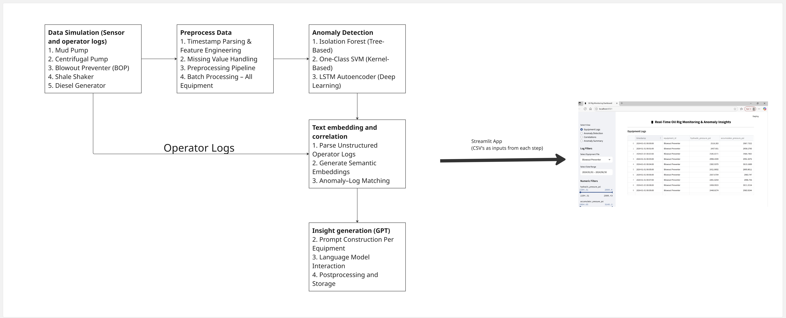

# Contents

**Case Study: Multi-Modal Anomaly Detection in Oil Rig Operations Using Time Series and Text Logs**  
Objective:  
Step:1 Simulate Data  
1. Mud Pump  
2. Centrifugal Pump  
3. Blowout Preventer (BOP)  
4. Shale Shaker  
5. Diesel Generator  
Step:2 Preprocess Data  
1. Timestamp Parsing & Feature Engineering  
2. Missing Value Handling  
3. Preprocessing Pipeline  
4. Batch Processing – All Equipment  
Step:3 Anomaly Detection  
1. Configuration & Setup  
2. Load Processed Sensor Files  
3. Isolation Forest (Tree-Based)  
4. One-Class SVM (Kernel-Based)  
5. LSTM Autoencoder (Deep Learning)  
Step:4 Text embedding and correlation  
1. Load Anomaly Outputs  
2. Parse Unstructured Operator Logs  
3. Generate Semantic Embeddings  
4. Anomaly–Log Matching (Semantic Correlation)  
5. Result Compilation  
6. Save Correlation Output  
Step:5 Insight generation  
1. Load API Key  
2. Prompt Construction Per Equipment  
3. Language Model Interaction  
4. Postprocessing and Storage  
Step:6 Streamlit-Based Real-Time Monitoring Dashboard  
1. App Setup & Styling  
2. File Mapping & Directory Initialization  
3. Sidebar Navigation  
4. Equipment Logs View  
5. Anomaly Detection View  
6. Correlation View  
7. Anomaly Summary View  
**Critical Analysis of the Approach**  
1. Potential Points of Failure  
2. Key Assumptions  
3. Improvements  
**Future Work**

---

# Case Study: Multi-Modal Anomaly Detection in Oil Rig Operations Using Time Series and Text Logs

## Objective:
Design and demonstrate a prototype system that detects anomalies in oil rig operations by combining sensor time series data and operator text logs. The focus is on the approach, reasoning, and deployment-readiness, not just accuracy.

---

## Pipeline architecture

## Step:1 Simulate Data

### Equipment’s selected:

### 1. Mud Pump
- **Description:** Circulates drilling mud into the wellbore to cool the bit and transport cuttings.
- **Normal Ranges:**
  - Pressure: 110–130 psi  
  - Flow Rate: 80–100 L/min  
  - Temperature: 50–65°C
- **Anomalies:**
  - Pressure < 90 psi → Leak  
  - Temp > 75°C → Overheating  
  - Flow < 60 L/min → Obstruction
- **Data Simulation Approach:**
  - Use sinusoidal + random walk for pressure and flow.
  - Inject sudden drops or gradual drifts for anomalies.
  - Columns: `timestamp, equipment_id, pressure_psi, flow_rate_lpm, pump_temp_C`
- **Operator Logs Generation:**
  - For each anomaly injected, a synthetic operator log is created.
  - Logs include:
    - Timestamp
    - Equipment name
    - Operator (random from fixed list)
    - Shift (A/B/C)
    - Observation/alert description (from pre-defined templates)
    - Sensor snapshot at the anomaly timestamp

### 2. Centrifugal Pump
- **Description:** Transfers fluids using centrifugal force; relies on consistent vibration and current draw.
- **Normal Ranges:**
  - Vibration: < 5 mm/s  
  - Bearing Temp: 45–60°C  
  - Motor Current: 50–70 A
- **Anomalies:**
  - Vibration > 7 mm/s → Cavitation  
  - Temp > 70°C → Bearing failure  
  - Current > 80 A → Impeller blockage
- **Data Simulation Approach:**
  - Simulate stable vibration with noise; inject random spikes.
  - Gradual rise in temp/current to simulate component wear.
  - Columns: `timestamp, equipment_id, vibration_mmps, bearing_temp_C, motor_current_A`
- **Operator Logs Generation:**
  - One log per anomaly event, capturing time, sensor state, and context.
  - Helps in identifying early signs of wear or cavitation from operator feedback.

### 3. Blowout Preventer (BOP)
- **Description:** High-pressure safety system that seals and controls the well during drilling.
- **Normal Ranges:**
  - Hydraulic Pressure: 1500–3000 psi  
  - Accumulator Pressure: ~3000 psi  
  - Valve Position: OPEN/CLOSED
- **Anomalies:**
  - Hydraulic Pressure < 1400 psi → Leak  
  - Stuck valve → No status change  
  - Sudden pressure drop → Accumulator issue
- **Data Simulation Approach:**
  - Create status toggles with pressure response.
  - Inject faults with frozen valve state or sudden drops.
  - Columns: `timestamp, equipment_id, hydraulic_pressure_psi, accumulator_pressure_psi, valve_status, command_signal`
- **Operator Logs Generation:**
  - One log per anomaly event, capturing time, sensor state, and context.
  - Helps in identifying early signs of wear or cavitation from operator feedback.

### 4. Shale Shaker
- **Description:** Separates solid drill cuttings from mud using vibrating screens.
- **Normal Ranges:**
  - Vibration Speed: 1800–2200 RPM  
  - Motor Load: 60–75%  
  - Throughput: 300–400 L/min
- **Anomalies:**
  - Vibration > 2500 RPM → Imbalance  
  - Motor Load > 85% → Blockage  
  - Throughput < 250 L/min → Clog/tear
- **Data Simulation Approach:**
  - Sinusoidal + noise for vibration; throughput linked to load.
  - Inject sudden spikes or drops for screen faults.
  - Columns: `timestamp, equipment_id, vibration_rpm, motor_load_pct, throughput_lpm`
- **Operator Logs Generation:**
  - Simulated operators note issues like excessive shaking or low fluid output.
  - Helps correlate sensor spikes with on-field observations.

### 5. Diesel Generator
- **Description:** Provides continuous power to the rig; must run efficiently across varying loads.
- **Normal Ranges:**
  - Load: 60–80%  
  - Oil Pressure: 35–50 psi  
  - Fuel Level: 40–100%  
  - Engine Temp: 75–95°C
- **Anomalies:**
  - Load > 90% → Overload  
  - Oil Pressure < 30 psi → Damage  
  - Engine Temp > 100°C → Overheat  
  - Fuel Drop > 10% in 15 min → Leak
- **Data Simulation Approach:**
  - Load as smoothed random walk; fuel decreases slowly.
  - Inject temperature surges and oil pressure dips.
  - Columns: `timestamp, equipment_id, load_pct, engine_temp_C, fuel_level_pct, oil_pressure_psi`
- **Operator Logs Generation:**
  - Includes notes like fuel leak suspicion, overheating alerts, or load spikes.
  - Logs provide human context to correlate unexpected changes.

---

## Step:2 Preprocess Data

This step involves cleaning, transforming, and standardizing raw sensor data files using a modular and reusable preprocessing pipeline.

### 1. Timestamp Parsing & Feature Engineering
Parses timestamps, sets them as the index, and enriches the data with time-based features such as hour, day, weekday, and weekend flags. It also supports optional resampling and interpolation of numeric data to create uniform time intervals.

### 2. Missing Value Handling
Handles missing values using configurable strategies like forward fill, backward fill, mean, or median imputation. Also provides an option to drop rows with any missing values entirely.

### 3. Preprocessing Pipeline
Combines timestamp handling and missing value treatment into a unified pipeline. This ensures that sensor data is cleaned, resampled, and standardized in a consistent manner.

### 4. Batch Processing – All Equipment
Processes multiple CSV files representing different equipment by applying the preprocessing pipeline to each. Saves the cleaned and transformed datasets into a specified output directory with structured logging.

---

## Step:3 Anomaly Detection

### 1. Configuration & Setup
- Sets directories for reading processed data and saving anomaly detection outputs.
- Creates output folder if it doesn't exist.
- Defines hyperparameters for each detection model:
  - Isolation Forest contamination rate
  - One-Class SVM nu values
  - LSTM Autoencoder time window, epochs, and contamination threshold

### 2. Load Processed Sensor Files
- Loads all preprocessed CSV files from the specified input directory.
- Each file represents sensor readings from a different equipment unit.
- Stores them in a dictionary format for batch processing.

### 3. Isolation Forest (Tree-Based)
- Runs a grid search over various contamination values to evaluate anomaly counts per file.
- Creates a pivot table summarizing anomaly counts per contamination level across all files.
- Executes Isolation Forest on each dataset using a selected contamination value.
- Saves annotated datasets with detected anomalies to the output directory.

### 4. One-Class SVM (Kernel-Based)
- Runs a grid search over different nu values to assess anomaly counts.
- Generates a pivot table showing how the anomaly counts vary across values and files.
- Applies One-Class SVM to all equipment datasets using a chosen nu value.
- Drops conflicting anomaly columns if they exist (e.g., from Isolation Forest).
- Saves results with One-Class SVM anomaly annotations.

### 5. LSTM Autoencoder (Deep Learning)
- Applies LSTM Autoencoder model to each file.
- Detects anomalies based on reconstruction error.
- Dynamically extracts numeric sensor columns for model input.
- Drops previous anomaly flags before saving.
- Saves anomaly-detected files and logs the reconstruction threshold used.

---

## Step:4 Text embedding and correlation

### 1. Load Anomaly Outputs
- Loads all previously saved CSV files that contain anomaly detection results.
- Each file corresponds to a specific equipment type and contains timestamped sensor data with anomaly flags.

### 2. Parse Unstructured Operator Logs
- Reads raw text logs written by operators during rig operations.
- Extracts structured information including:
  a. Timestamps  
  b. Equipment types (e.g., blowout preventer, drill pipe)  
  c. Freeform log text messages

### 3. Generate Semantic Embeddings
- Loads a pretrained sentence embedding model (all-MiniLM-L6-v2).
- Converts each operator log message into a high-dimensional embedding vector.
- Similarly, generates embeddings for anomaly descriptions to enable semantic comparison.

### 4. Anomaly–Log Matching (Semantic Correlation)
- For each anomaly in each dataset:
  a. Matches log entries within a specified time window (±240 minutes).  
  b. Computes cosine similarity between the anomaly text and log message embeddings.  
  c. Filters matches above a defined similarity threshold.  
  d. Extracts sensor readings and metadata associated with each matched anomaly.

### 5. Result Compilation
- For each correlated anomaly-log pair:  
  a. Records anomaly time, log time, equipment type, texts, and similarity score.  
  b. Includes all associated sensor readings for context.  
- Sorts and keeps the top 20 most similar correlations per anomaly file.

### 6. Save Correlation Output
- Merges all correlation results across equipment.
- Saves the final structured correlation table as a CSV file.
- Creates output directory if it doesn’t exist.

---

## Step:5 Insight generation

### 1. Load API Key
- Loads the OpenAI API key from a YAML configuration file.
- Ensures secure and modular access to the model authentication credentials.

### 2. Prompt Construction Per Equipment
- Iterates over anomaly-log correlation entries grouped by equipment_type.
- For each group, constructs a detailed prompt containing:
  a. The anomaly and operator log context.  
  b. Clear instructions to output a tabular summary with standardized fields:
    i. Equipment name  
    ii. Total anomalies  
    iii. Most recent anomaly details  
    iv. Diagnosis and likely root cause  
    v. Relevant operator log  
    vi. Actionable maintenance review

### 3. Language Model Interaction
- Sends each equipment-specific prompt to the OpenAI API (e.g., GPT-3.5-turbo).
- Controls output format using:
  a. Moderate temperature for balanced creativity and accuracy.  
  b. Token limit to manage response length.  
- Extracts and stores the LLM-generated summary text.

### 4. Postprocessing and Storage
- Collects all generated summaries into a structured DataFrame.
- Saves final output as a CSV file, where each row corresponds to one equipment type and its diagnosis summary.

---

## Step:6 Streamlit-Based Real-Time Monitoring Dashboard

### 1. App Setup & Styling
- Configures the Streamlit app with a custom title, icon, and wide layout.
- Applies custom CSS to:
  a. Hide default Streamlit UI elements (e.g., footer/menu).  
  b. Enforce consistent typography.  
  c. Implement a sticky header for persistent visibility.  
  d. Disable vertical scrolling to keep views contained on one screen.

### 2. File Mapping & Directory Initialization
- Defines paths for key data categories:
  a. Raw equipment sensor logs  
  b. Detected anomaly results  
  c. Anomaly-log correlation outputs  
  d. Final anomaly summary table  
- Dynamically maps file names into clean, user-friendly dropdown labels.

### 3. Sidebar Navigation
Adds a sidebar radio menu for switching between the following dashboard views:
- Equipment Logs  
- Anomaly Detection  
- Correlations  
- Anomaly Summary

### 4. Equipment Logs View
- Loads and displays raw sensor log files per selected equipment.
  a. Enables filtering by:
  b. Date range (via detected time columns)  
  c. Numeric parameter ranges (via sliders)  
- Shows filtered logs as a responsive table.

### 5. Anomaly Detection View
- Displays anomaly detection output from prior model runs.
  a. Filters by:
  b. Equipment type  
  c. Time range  
  d. Numeric anomaly indicators (e.g., scores or sensor values)  
- Allows inspection of time-localized anomaly events.

### 6. Correlation View
- Loads and displays log-anomaly correlation entries generated earlier.
- Allows filtering by equipment name.
- Useful for verifying alignment between detected anomalies and operator observations.

### 7. Anomaly Summary View
- Loads the final, GPT-generated diagnosis summaries.
- Users can view summaries for:
  a. All equipment combined  
  b. A specific equipment type  
- Each card-style section includes:
  a. Total anomaly count  
  b. Latest anomaly timestamp and description  
  c. Root cause diagnosis  
  d. Relevant operator log snippet  
  e. Actionable maintenance recommendations

---

## Critical Analysis of the Approach

### 1. Potential Points of Failure
- **Noisy Logs:** Unstructured or irrelevant operator logs may confuse embeddings and reduce context accuracy.  
- **False Positives:** Time-window-based correlation can wrongly link unrelated anomalies and logs.  
- **Prompt Sensitivity:** GPT summaries depend heavily on the quality of prompt formatting and may hallucinate details.

### 2. Key Assumptions
- Logs and anomalies are timestamped accurately and meaningfully.  
- Similarity between log-anomaly pairs is sufficient for meaningful grouping.  
- GPT can interpret domain-specific anomalies with general instruction prompts.

### 3. Improvements
- Add sensor metadata, severity scores, or anomaly types for richer context.  
- Use domain-tuned models (e.g., finetuned GPT or SciBERT).  
- Include human-in-the-loop validation or expert feedback to refine root cause accuracy.  
- Integrate log classification models to filter noise before correlation.

---

## Future Work

1. **Domain-Specific Fine-Tuning**  
   Train or fine-tune LLMs (e.g., GPT, SciBERT) on oil rig logs and failure reports for more accurate diagnostics.

2. **Advanced Log Preprocessing**  
   Use NLP techniques to denoise logs, extract structured entities (equipment names, failure types), and improve relevance.

3. **Anomaly Categorization**  
   Auto-label anomalies by severity/type to prioritize analysis and enable dashboard filtering.

4. **Real-Time Streaming Support**  
   Extend pipeline to support real-time anomaly detection and contextual logging using Kafka or similar frameworks.

5. **Feedback Loop Integration**  
   Collect expert feedback on generated summaries to iteratively improve model prompts, validation, and performance.

6. **Sensor Fusion Analytics**  
   Combine logs with structured sensor signals for multi-modal anomaly reasoning.

7. **Confidence Scoring**  
   Add trust metrics or confidence levels to each generated diagnosis using ensemble methods or uncertainty modeling.

8. **Root Cause Explanation Graphs**  
   Visualize anomaly-log-sensor connections via explainable AI frameworks (e.g., SHAP, LIME for sensor-driven models).
